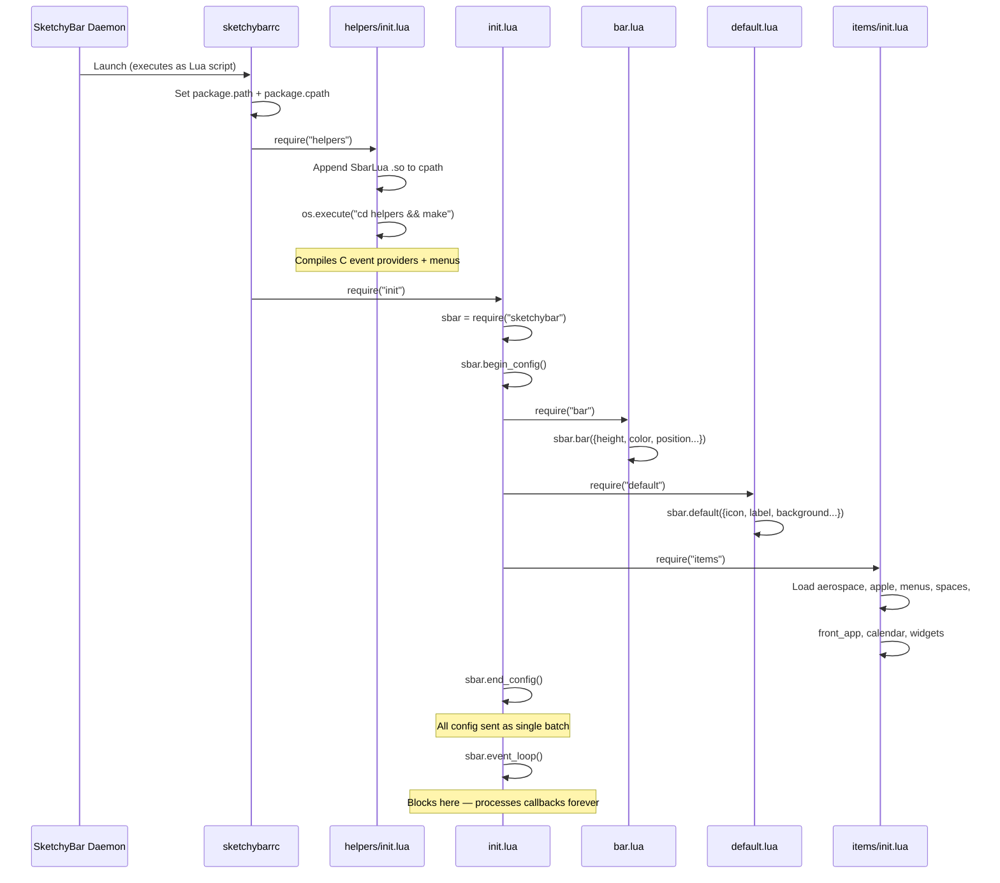
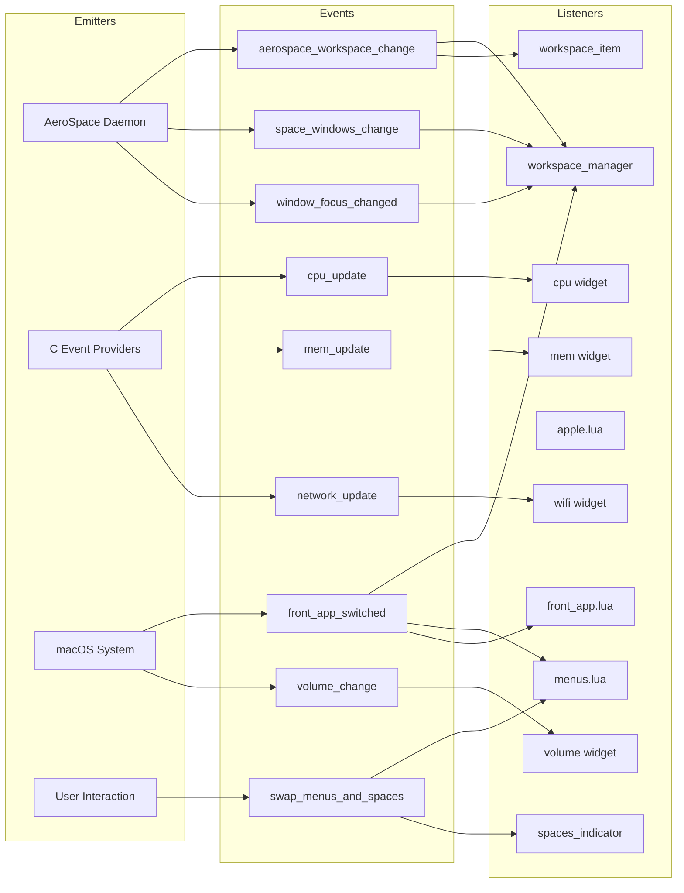
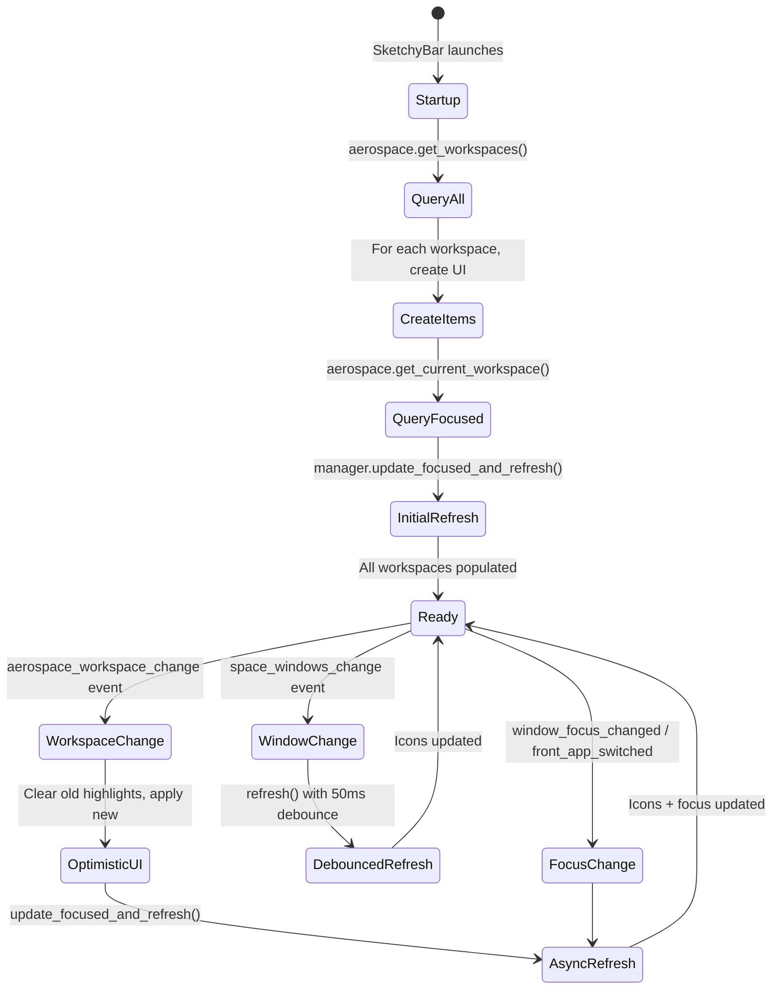
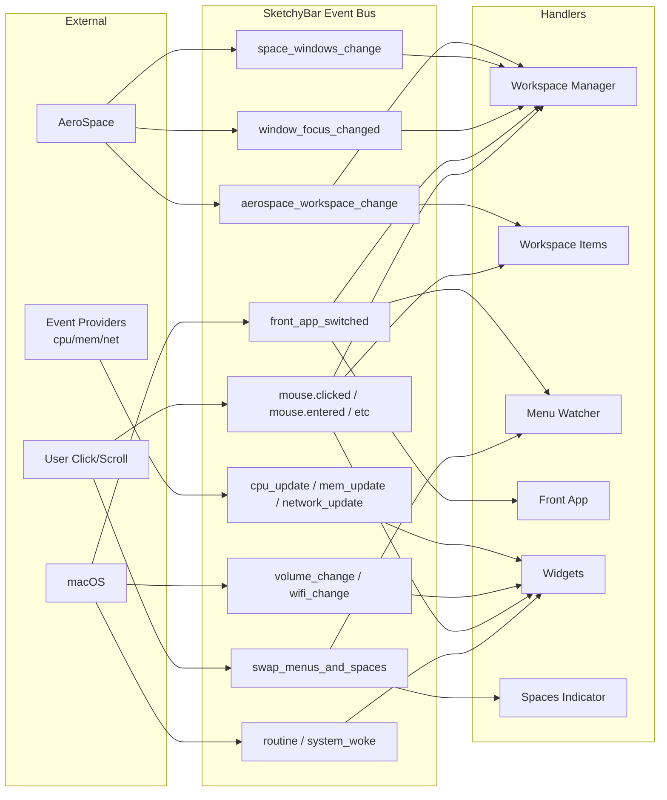
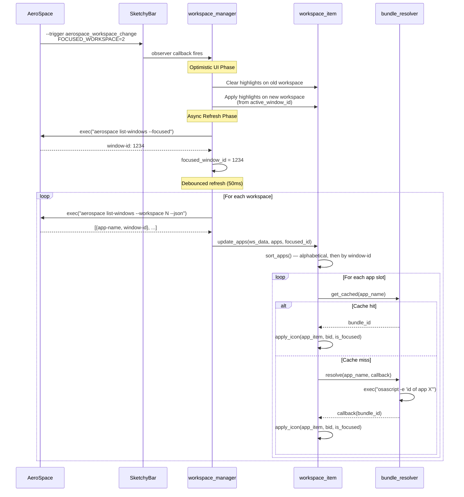
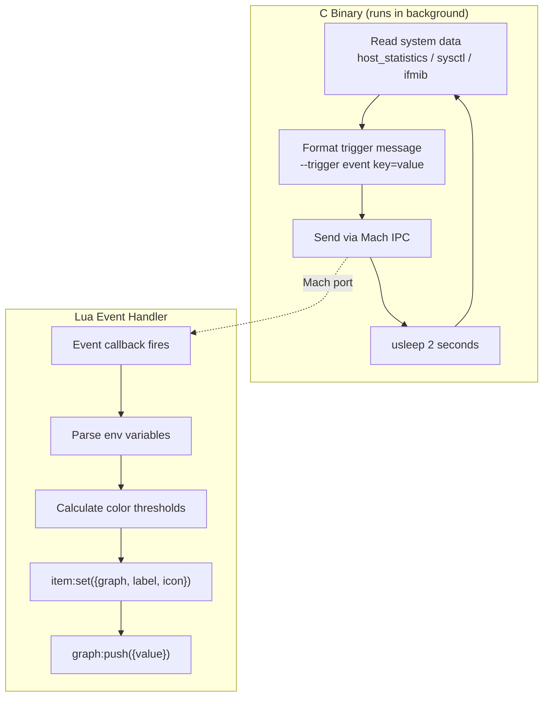
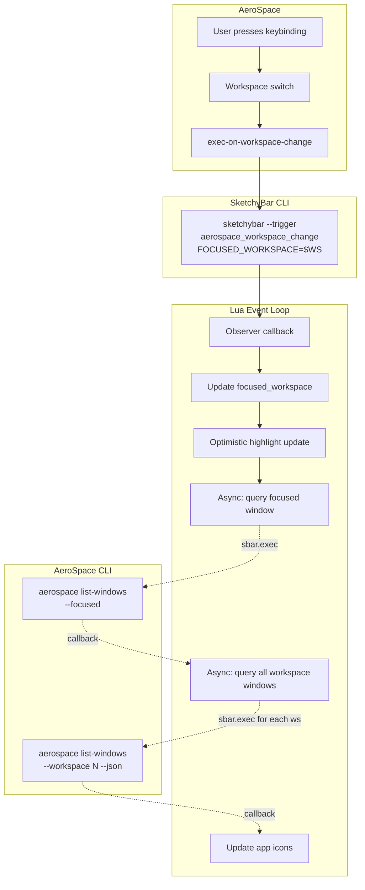

# SketchyBar + AeroSpace — Project Architecture

> **A comprehensive technical deep-dive into a Lua-driven macOS status bar configuration that integrates the AeroSpace tiling window manager with SketchyBar.**

---

## Table of Contents

1. [High-Level Architecture](#1-high-level-architecture)
2. [Folder & File Structure](#2-folder--file-structure)
3. [Execution Workflow](#3-execution-workflow)
4. [Event System Analysis](#4-event-system-analysis)
5. [SketchyBar Internals](#5-sketchybar-internals)
6. [AeroSpace Integration](#6-aerospace-integration)
7. [Script-by-Script Deep Dive](#7-script-by-script-deep-dive)
8. [Dependency & Tooling Analysis](#8-dependency--tooling-analysis)
9. [Configuration Design Patterns](#9-configuration-design-patterns)
10. [Visual Workflow Diagrams](#10-visual-workflow-diagrams)
11. [How This Project Actually Thinks](#11-how-this-project-actually-thinks)
12. [Refactoring Suggestions](#12-refactoring-suggestions)
13. [Debugging Guide](#13-debugging-guide)
14. [Final Summary](#14-final-summary)

---

## 1. High-Level Architecture

### What the Project Does

This project replaces the native macOS menu bar with a fully custom, programmable status bar powered by **SketchyBar**. It integrates deeply with **AeroSpace** (a tiling window manager for macOS) to provide:

- **Live workspace indicators** — each AeroSpace workspace is shown as a clickable pill with app icons for every window on that workspace.
- **Focused window tracking** — the currently focused window is visually highlighted across all workspaces.
- **System widgets** — battery, CPU, memory, network, volume, and calendar.
- **Application menu mirroring** — the front application's menu bar items are rendered inside SketchyBar itself, replacing the native menu bar.
- **AeroSpace service-mode indicator** — the Apple logo item changes appearance when AeroSpace enters "service mode" (a modifier mode for keybindings).
- **Media controls** — (currently disabled) a now-playing widget with album art and playback controls.

### How SketchyBar and AeroSpace Interact

```
┌──────────────────────────────────────────────────────────────────┐
│                          macOS System                            │
│                                                                  │
│  ┌──────────────┐    exec("aerospace ...")    ┌──────────────┐   │
│  │  SketchyBar  │ ◄────────────────────────── │   AeroSpace  │   │
│  │  (Lua config)│ ─────────────────────────►  │  (WM daemon) │   │
│  │              │    "sketchybar --trigger"    │              │   │
│  └──────┬───────┘                             └──────────────┘   │
│         │                                                        │
│         │ Mach IPC                                               │
│  ┌──────▼───────┐                                                │
│  │ Event        │  C binaries fire custom events via Mach ports  │
│  │ Providers    │  (cpu_load, mem_load, network_load)            │
│  └──────────────┘                                                │
└──────────────────────────────────────────────────────────────────┘
```

**Communication is bidirectional:**

| Direction | Mechanism | Purpose |
|-----------|-----------|---------|
| AeroSpace → SketchyBar | AeroSpace `exec-on-workspace-change` triggers `sketchybar --trigger aerospace_workspace_change` | Notifies bar of workspace switches |
| SketchyBar → AeroSpace | Lua calls `sbar.exec("aerospace list-windows ...")` | Queries window/workspace state |
| Event Providers → SketchyBar | C binaries send Mach IPC messages via `sketchybar.h` | Push CPU/memory/network data |
| SketchyBar → macOS | Lua calls `sbar.exec("pmset ...")`, `osascript`, etc. | Queries battery, volume, network info |

### Event-Driven Architecture Overview

The project is fundamentally **event-driven**. Nothing polls continuously in Lua — instead:

1. **Native events** (`front_app_switched`, `volume_change`, `wifi_change`, `system_woke`) are emitted by SketchyBar itself when macOS notifies it.
2. **Custom events** (`aerospace_workspace_change`, `space_windows_change`, `window_focus_changed`, `cpu_update`, `mem_update`, `network_update`) are triggered externally — either by AeroSpace or by the C event-provider binaries.
3. **Periodic events** (`routine`) fire on a configurable `update_freq` interval for items that need time-based refresh (e.g., calendar every 30s, battery every 180s).
4. **Mouse events** (`mouse.clicked`, `mouse.entered`, `mouse.exited`, `mouse.scrolled`, `mouse.exited.global`) enable interactivity.

### Data Flow

```
AeroSpace daemon
    │
    ├── exec-on-workspace-change → sketchybar --trigger aerospace_workspace_change
    │
    └── queried by Lua via:
         aerospace list-workspaces --all
         aerospace list-workspaces --focused
         aerospace list-windows --workspace X --json
         aerospace focus --window-id N

Event Providers (C)
    │
    └── Mach IPC → sketchybar --trigger cpu_update/mem_update/network_update

macOS System
    │
    ├── front_app_switched (native)
    ├── volume_change (native)
    ├── wifi_change (native)
    ├── power_source_change (native)
    ├── system_woke (native)
    └── media_change (native)

All events → Lua callback functions → sbar:set() / sbar:push() → UI updates
```

---

## 2. Folder & File Structure

### Annotated Tree

```
sketchybar/                          # ── Root config directory (~/.config/sketchybar)
│
├── sketchybarrc                     # [STARTUP SCRIPT] Entry point — executed by SketchyBar on launch
├── main                             # [BINARY] Compiled SbarLua Mach-O binary (the Lua runtime bridge)
│
├── init.lua                         # [ORCHESTRATOR] Top-level Lua bootstrap — loads bar, defaults, items
├── bar.lua                          # [CONFIGURATION] Bar-level properties (height, color, position)
├── default.lua                      # [CONFIGURATION] Default properties inherited by all items
├── colors.lua                       # [DESIGN TOKEN] Color palette (hex ARGB) + with_alpha() utility
├── icons.lua                        # [DESIGN TOKEN] SF Symbols / Nerd Font icon constants
├── settings.lua                     # [DESIGN TOKEN] Centralized tuning knobs (fonts, sizes, paddings)
│
├── items/                           # ── All bar items (left, center, right)
│   ├── init.lua                     # [ORCHESTRATOR] Loads all item modules in order
│   │
│   ├── aerospace.lua                # [HELPER LIBRARY] AeroSpace CLI wrappers (query workspaces, monitors)
│   ├── apple.lua                    # [UI COMPONENT] Apple logo button + service-mode indicator
│   ├── menus.lua                    # [UI COMPONENT] Application menu bar mirror (left side)
│   ├── front_app.lua                # [UI COMPONENT] Focused application name display
│   ├── calendar.lua                 # [UI COMPONENT] Date/time display (right side)
│   ├── spaces.lua                   # [ORCHESTRATOR] Workspace display system — wires item factory + manager
│   ├── spaces_indicator.lua         # [UI COMPONENT] Toggle switch for spaces ↔ menus view
│   ├── media.lua                    # [UI COMPONENT] Now-playing widget (currently disabled)
│   │
│   ├── spaces/                      # ── Workspace display subsystem
│   │   ├── workspace_item.lua       # [UI FACTORY] Creates all SketchyBar items for one workspace
│   │   ├── workspace_manager.lua    # [STATE MANAGER] Global state, debounced refresh, event orchestration
│   │   └── bundle_resolver.lua      # [HELPER UTILITY] Resolves app names → macOS bundle IDs (cached)
│   │
│   └── widgets/                     # ── Right-side system widgets
│       ├── init.lua                 # [ORCHESTRATOR] Loads all widget modules
│       ├── battery.lua              # [UI COMPONENT] Battery percentage + charging status + popup
│       ├── cpu.lua                  # [UI COMPONENT] CPU load graph (driven by C event provider)
│       ├── memory.lua               # [UI COMPONENT] Memory pressure graph (driven by C event provider)
│       ├── volume.lua               # [UI COMPONENT] Volume control + audio device switcher popup
│       └── wifi.lua                 # [UI COMPONENT] Network speed + Wi-Fi info popup
│
└── helpers/                         # ── Native helpers, build scripts, utilities
    ├── init.lua                     # [BUILD TRIGGER] Adds SbarLua to cpath + runs `make` on startup
    ├── makefile                     # [BUILD SCRIPT] Delegates to event_providers/ and menus/ makefiles
    ├── install                      # [INSTALL SCRIPT] Installs all brew deps, fonts, SbarLua (bash)
    ├── install.sh                   # [INSTALL SCRIPT] Identical to `install` (duplicate)
    │
    ├── app_icons.lua                # [ICON MAP] App name → sketchybar-app-font glyph (216 entries)
    ├── default_font.lua             # [DESIGN TOKEN] Fallback font config (currently unused at runtime)
    ├── cycle_windows.sh             # [UTILITY] Cycles focus through windows in workspace order
    ├── set_window_level             # [BINARY] Compiled helper (window level manipulation)
    ├── test_sticky                  # [BINARY] Compiled helper (sticky window testing)
    │
    ├── event_providers/             # ── Native C event emitters
    │   ├── sketchybar.h             # [C HEADER] Mach IPC communication API for event providers
    │   ├── makefile                 # [BUILD SCRIPT] Builds all three providers
    │   │
    │   ├── cpu_load/                # ── CPU load event provider
    │   │   ├── cpu.h                # [C HEADER] Mach host_statistics API wrapper
    │   │   ├── cpu_load.c           # [C SOURCE] Main loop: poll → trigger "cpu_update" event
    │   │   ├── makefile             # [BUILD SCRIPT]
    │   │   └── bin/cpu_load         # [BINARY] Compiled provider
    │   │
    │   ├── mem_load/                # ── Memory pressure event provider
    │   │   ├── mem.h                # [C HEADER] kern.memorystatus_level sysctl wrapper
    │   │   ├── mem_load.c           # [C SOURCE] Main loop: poll → trigger "mem_update" event
    │   │   ├── makefile             # [BUILD SCRIPT]
    │   │   └── bin/mem_load         # [BINARY] Compiled provider
    │   │
    │   └── network_load/            # ── Network throughput event provider
    │       ├── network.h            # [C HEADER] BSD sysctl ifmib network interface wrapper
    │       ├── network_load.c       # [C SOURCE] Main loop: poll → trigger "network_update" event
    │       ├── makefile             # [BUILD SCRIPT]
    │       └── bin/network_load     # [BINARY] Compiled provider
    │
    └── menus/                       # ── Native menu bar helper
        ├── menus.c                  # [C SOURCE] Accessibility API menu listing + clicking
        ├── makefile                 # [BUILD SCRIPT] Links Carbon + SkyLight frameworks
        └── bin/menus                # [BINARY] Compiled menu helper
```

### File Roles Summary

| Role | Files |
|------|-------|
| **Entry Points** | `sketchybarrc`, `init.lua`, `helpers/init.lua` |
| **Design Tokens** | `colors.lua`, `icons.lua`, `settings.lua` |
| **Configuration** | `bar.lua`, `default.lua` |
| **UI Components** | `apple.lua`, `calendar.lua`, `front_app.lua`, `menus.lua`, `media.lua`, `spaces_indicator.lua`, all `widgets/*.lua` |
| **State Manager** | `workspace_manager.lua` |
| **Factories** | `workspace_item.lua` |
| **Helper Libraries** | `aerospace.lua`, `bundle_resolver.lua`, `app_icons.lua` |
| **Native Code** | `cpu_load.c`, `mem_load.c`, `network_load.c`, `menus.c`, `sketchybar.h` |
| **Utilities** | `cycle_windows.sh`, `set_window_level`, `test_sticky` |
| **Build/Install** | `install`, `install.sh`, all `makefile` files |

---

## 3. Execution Workflow

### Step-by-Step Startup Sequence



### Detailed Startup Phases

#### Phase 1: Environment Setup (`sketchybarrc`)
```lua
-- 1. Determine config directory
local config_dir = os.getenv("HOME") .. "/.config/sketchybar"

-- 2. Add config dir to Lua module search paths
package.path = config_dir .. "/?.lua;" .. config_dir .. "/?/init.lua;" .. package.path
package.cpath = config_dir .. "/?.so;" .. package.cpath

-- 3. Load helpers (builds native code + sets up SbarLua)
require("helpers")

-- 4. Load main config
require("init")
```

#### Phase 2: Native Build (`helpers/init.lua`)
```lua
-- 1. Add SbarLua shared library to Lua loader path
package.cpath = package.cpath .. ";/Users/" .. os.getenv("USER") .. "/.local/share/sketchybar_lua/?.so"

-- 2. Build all C helpers (blocks until complete)
os.execute("(cd helpers && make)")
```

The `make` cascade:
```
helpers/makefile
  → event_providers/makefile
      → cpu_load/makefile   → bin/cpu_load
      → mem_load/makefile   → bin/mem_load  
      → network_load/makefile → bin/network_load
  → menus/makefile          → bin/menus
```

#### Phase 3: Configuration Batch (`init.lua`)
```lua
sbar.begin_config()   -- Buffer all commands
  require("bar")      -- Set bar-level properties
  require("default")  -- Set default item properties
  require("items")    -- Create all items, brackets, events
sbar.end_config()     -- Flush entire config at once (performance optimization)
```

#### Phase 4: Items Loading Order (`items/init.lua`)
```lua
require("items.aerospace")       -- 1. AeroSpace helper library
require("items.apple")           -- 2. Apple logo + service mode events
require("items.menus")           -- 3. Menu bar mirror
require("items.spaces")          -- 4. Workspace display system
require("items.front_app")       -- 5. Focused app name
require("items.calendar")        -- 6. Date/time
require("items.widgets")         -- 7. Battery, volume, wifi, cpu, memory
```

> [!IMPORTANT]
> Loading order matters. `aerospace.lua` must load first because `spaces.lua` imports it. `menus.lua` must load before `spaces.lua` because menus creates the `swap_menus_and_spaces` event that `spaces_indicator.lua` subscribes to.

#### Phase 5: Event Loop
```lua
sbar.event_loop()  -- Blocks forever, dispatches callbacks
```

This is the reactor. Without this call, no callback functions would ever execute. The Lua process stays alive for the lifetime of SketchyBar.

### What Happens When AeroSpace Triggers a Workspace Change

```
1. User presses keybinding (e.g., Alt+2)
2. AeroSpace switches to workspace "2"
3. AeroSpace exec-on-workspace-change runs:
   sketchybar --trigger aerospace_workspace_change \
     FOCUSED_WORKSPACE=2 PREV_WORKSPACE=1
4. SketchyBar receives the trigger
5. All items subscribed to "aerospace_workspace_change" fire:
   - workspace_item's number_item → updates highlight
   - workspace_item's bracket → updates background color
   - workspace_manager's observer → updates focused_workspace,
     clears old highlights, applies new highlights,
     runs update_focused_and_refresh()
6. update_focused_and_refresh() → exec("aerospace list-windows --focused")
   → callback sets focused_window_id → calls refresh()
7. refresh() (debounced 50ms) → for each workspace:
   exec("aerospace list-windows --workspace X --json")
   → callback calls update_workspace() → updates app icons
```

---

## 4. Event System Analysis

### Complete Event Registry

#### Custom Events (Registered with `sbar.add("event", ...)`)

| Event Name | Registered In | Emitted By | Purpose |
|-----------|--------------|-----------|---------|
| `aerospace_workspace_change` | `spaces.lua` | AeroSpace CLI | Workspace focus changed |
| `space_windows_change` | `spaces.lua` | AeroSpace CLI / `menus.lua` | Windows added/removed on a workspace |
| `window_focus_changed` | `spaces.lua` | AeroSpace CLI | Different window gained focus |
| `aerospace_enter_service_mode` | `apple.lua` | AeroSpace CLI | AeroSpace entered service mode |
| `aerospace_leave_service_mode` | `apple.lua` | AeroSpace CLI | AeroSpace left service mode |
| `swap_menus_and_spaces` | `menus.lua` | Internal (triggered by click) | Toggle between menus and spaces views |
| `cpu_update` | C provider | `cpu_load` binary | CPU load data available |
| `mem_update` | C provider | `mem_load` binary | Memory pressure data available |
| `network_update` | C provider | `network_load` binary | Network throughput data available |

#### Native Events (Built into SketchyBar)

| Event Name | Subscribers | Purpose |
|-----------|------------|---------|
| `front_app_switched` | `menus.lua`, `workspace_manager.lua`, `front_app.lua` | Active application changed |
| `volume_change` | `volume.lua` | System volume changed |
| `wifi_change` | `wifi.lua` | Wi-Fi connection state changed |
| `power_source_change` | `battery.lua` | AC/battery power source changed |
| `system_woke` | `battery.lua`, `calendar.lua`, `wifi.lua` | Mac woke from sleep |
| `routine` | `battery.lua`, `calendar.lua` | Periodic timer fired (per `update_freq`) |
| `forced` | `calendar.lua` | Manual force-refresh |
| `media_change` | `media.lua` | Now-playing info changed |

#### Mouse Events

| Event | Subscribers | Action |
|-------|------------|--------|
| `mouse.clicked` | Nearly all items | Primary interaction (toggle popup, switch workspace, focus window) |
| `mouse.entered` | Workspace app slots | Hover highlight effect |
| `mouse.exited` | Workspace app slots | Remove hover highlight |
| `mouse.exited.global` | Volume, WiFi popups, Media | Close popups when cursor leaves |
| `mouse.scrolled` | Volume items | Adjust volume with scroll wheel |

### Event Flow: Who Emits → Who Listens → What Happens



### Event Propagation Detail

**`aerospace_workspace_change` propagation:**

| Step | Component | Action |
|------|----------|--------|
| 1 | `workspace_item.lua` — number_item | Sets `icon.highlight` based on `env.FOCUSED_WORKSPACE == workspace` |
| 2 | `workspace_item.lua` — bracket | Updates `background.color` to highlight/default |
| 3 | `workspace_manager.lua` — observer | Stores new `focused_workspace`, clears old workspace highlights, applies highlights on new workspace, calls `update_focused_and_refresh()` |

**`swap_menus_and_spaces` propagation:**

| Step | Component | Action |
|------|----------|--------|
| 1 | `menus.lua` — space_menu_swap | Queries current state → if menus showing: hide menus, show spaces, show front_app; if spaces showing: hide spaces, show menus, hide front_app |
| 2 | `spaces_indicator.lua` | Toggles switch icon between on/off |

---

## 5. SketchyBar Internals

### How Items Are Created

Items are created via `sbar.add(type, [name], properties)`. The Lua API mirrors SketchyBar's `--add` command:

```lua
-- Basic item
local item = sbar.add("item", "my_item_name", {
    position = "right",        -- "left" (default), "right", "center", "popup.<parent>"
    icon = { string = "A" },
    label = { string = "hello" },
    update_freq = 60,          -- seconds between "routine" events
    updates = true             -- receive update events
})

-- Graph item (for CPU/memory sparklines)
local graph = sbar.add("graph", "cpu_graph", 42, {  -- 42 = number of data points
    graph = { color = 0xff00ff00 }
})

-- Slider item (for volume)
local slider = sbar.add("slider", 250, {  -- 250 = width
    slider = { highlight_color = 0xff0000ff }
})
```

### How Properties Are Updated

```lua
-- Set properties on a single item
item:set({
    icon = { string = "new_icon", color = 0xffff0000 },
    label = { string = "new_label" }
})

-- Set properties on multiple items via regex
sbar.set("/menu\\.*/", { drawing = false })

-- Query current properties
local query = item:query()
-- query.geometry.drawing == "on" or "off"
-- query.icon.value == "current icon string"
```

### How Animations Work

```lua
sbar.animate("tanh", 10, function()
    -- All :set() calls inside this block are animated
    -- "tanh" = easing curve (hyperbolic tangent)
    -- 10 = duration in frames (not seconds)
    item:set({
        icon = { string = new_icon },
        background = { color = new_color }
    })
end)
```

Used in `apple.lua` for smooth service-mode transitions.

### How Brackets/Groups Work

Brackets group multiple items visually under a shared background:

```lua
-- Group items by name list
sbar.add("bracket", "my_bracket", { item1.name, item2.name }, {
    background = {
        color = 0x40ffffff,
        corner_radius = 8,
        height = 30
    }
})

-- Group items by regex pattern
sbar.add("bracket", { '/menu\\..*/' }, {
    background = { color = 0x40ffffff }
})
```

Each workspace uses a bracket to visually group the workspace number + all app icons into a single rounded pill.

### How Popup Menus Work

Popups are nested item containers attached to a parent:

```lua
-- Parent item with popup config
local parent = sbar.add("item", "parent", {
    popup = { align = "center", horizontal = true }
})

-- Child items positioned inside the popup
sbar.add("item", {
    position = "popup." .. parent.name,   -- key: "popup.<parent_name>"
    label = "Option 1",
    click_script = "echo clicked"
})

-- Toggle popup visibility
parent:set({ popup = { drawing = "toggle" } })
```

Used by: battery (remaining time), volume (device switcher + slider), wifi (network details), media (playback controls).

### How Icons and Labels Are Rendered

- **SF Symbols**: Used via their Unicode codepoints (e.g., `"􀛨"` for battery full). Requires the `SF Pro` font family.
- **Nerd Font glyphs**: Used for the Apple logo (`""`) via `FiraCode Nerd Font Mono`.
- **sketchybar-app-font**: Special icon font where `:app_name:` syntax renders app-specific icons.
- **App bundle images**: `background.image = "app.<bundle.id>"` renders the actual macOS app icon as a background image.

### How Scripts Update Bar Items Dynamically

The primary mechanism is `sbar.exec()` for async shell commands:

```lua
sbar.exec("pmset -g batt", function(result)
    -- result is stdout as a string
    -- Parse and update item
    battery:set({ label = parsed_value })
end)
```

Key: `sbar.exec()` is **asynchronous** — the callback fires when the command completes, keeping the event loop responsive.

---

## 6. AeroSpace Integration

### How AeroSpace Communicates with SketchyBar

AeroSpace uses its `exec-on-workspace-change` configuration to trigger SketchyBar events:

```toml
# In AeroSpace config (aerospace.toml):
exec-on-workspace-change = [
    '/bin/bash', '-c',
    'sketchybar --trigger aerospace_workspace_change FOCUSED_WORKSPACE=$AEROSPACE_FOCUSED_WORKSPACE PREV_WORKSPACE=$AEROSPACE_PREV_WORKSPACE'
]
```

Similarly for other events:
```toml
# Window focus changes
exec-on-window-focus-change = [
    'sketchybar --trigger window_focus_changed'
]

# Window creation/destruction
exec-on-window-event = [
    'sketchybar --trigger space_windows_change'
]

# Service mode
on-focused-monitor-change = [...]
```

### AeroSpace CLI Commands Used

| Command | Used In | Purpose |
|---------|---------|---------|
| `aerospace list-workspaces --all` | `aerospace.lua` | Get all workspace names |
| `aerospace list-workspaces --focused` | `aerospace.lua` | Get currently focused workspace |
| `aerospace list-workspaces --monitor N` | `aerospace.lua` | Get workspaces on specific monitor |
| `aerospace list-workspaces --monitor N --visible` | `aerospace.lua` | Get visible workspace on monitor |
| `aerospace list-monitors \| awk '{print $1}'` | `aerospace.lua` | Get all monitor IDs |
| `aerospace list-windows --workspace X --format '...' --json` | `workspace_manager.lua` | Get windows on a workspace (JSON array) |
| `aerospace list-windows --focused --format '%{window-id}'` | `workspace_manager.lua` | Get focused window ID |
| `aerospace workspace N` | `workspace_item.lua` | Switch to workspace (on click) |
| `aerospace focus --window-id N` | `workspace_item.lua` | Focus specific window (on click) |

### How Workspace State Is Synchronized



### Focused Window Tracking

The system uses a **two-tier tracking** approach:

1. **Global `focused_window_id`** (in `workspace_manager.lua`): Updated by querying `aerospace list-windows --focused`. This is the source of truth.
2. **Per-workspace `active_window_id`** (in `workspace_item.lua`): Remembers the last focused window on each workspace. Used for **optimistic UI** — when switching to a workspace, immediately highlight the last-known active window before the async query completes.

### Multi-Monitor Support

`aerospace.lua` provides monitor-aware queries:

```lua
function M.is_workspace_selected(workspace)
    local available_monitors = M.get_monitors()
    for _, monitor in ipairs(available_monitors) do
        local visible_workspace = M.get_visible_workspace_on_monitor(monitor)
        if visible_workspace == workspace then return true end
    end
    return false
end
```

This ensures that on multi-monitor setups, a workspace visible on *any* monitor is treated as "selected."

---

## 7. Script-by-Script Deep Dive

### `sketchybarrc` — Entry Point

| Property | Detail |
|----------|--------|
| **Responsibility** | Bootstrap the Lua config environment |
| **Inputs** | `$HOME` environment variable |
| **Outputs** | Sets `package.path`, `package.cpath`, loads modules |
| **Dependencies** | Lua runtime, SbarLua `.so` |
| **Why it exists** | SketchyBar expects a `sketchybarrc` file. This is the bridge between SketchyBar's config loader and the Lua module system. |

### `init.lua` — Bootstrap Orchestrator

| Property | Detail |
|----------|--------|
| **Responsibility** | Wire up the entire config in the correct order |
| **Key Decision** | Uses `sbar.begin_config()` / `sbar.end_config()` to batch all initial setup into a single IPC message. This prevents visual flickering during startup. |
| **Critical Line** | `sbar.event_loop()` — without this, the process exits immediately and no callbacks work. |

### `colors.lua` — Color Palette

| Property | Detail |
|----------|--------|
| **Format** | ARGB hex as Lua numbers (e.g., `0xff181819` = opaque dark gray) |
| **Notable** | Includes a `with_alpha()` utility function that bit-masks the alpha channel. `rainbow` table provides 12 colors for dynamic indexing. |
| **Env Vars** | None |
| **Dependencies** | None (pure data) |

### `settings.lua` — Centralized Configuration

| Property | Detail |
|----------|--------|
| **Responsibility** | Single source of truth for all tunable values |
| **Key Config** | `app.max_apps_per_workspace = 8` — controls how many app icons appear per workspace. `font.icon = "FiraCode Nerd Font Mono"` and `font.text = "SF Pro Display"` |
| **Design** | Uses a `style_map` to abstract font weight names, allowing theme-level changes without touching individual items. |
| **Dependencies** | `colors.lua`, `icons.lua` |

### `aerospace.lua` — AeroSpace Helper Library

| Property | Detail |
|----------|--------|
| **Responsibility** | Abstract all AeroSpace CLI interactions into clean Lua functions |
| **API** | `get_workspaces()`, `get_current_workspace()`, `get_monitors()`, `get_workspaces_on_monitor(m)`, `get_visible_workspace_on_monitor(m)`, `is_workspace_selected(ws)` |
| **Performance** | Uses `io.popen()` (synchronous) — this is fine at startup but would block the event loop if called during normal operation. During normal operation, `sbar.exec()` (async) is used instead. |
| **Potential Issue** | `io.popen()` calls block the Lua event loop. This is intentional at startup (called before `sbar.event_loop()`), but would be problematic if called later. |

### `workspace_manager.lua` — The Brain

| Property | Detail |
|----------|--------|
| **Responsibility** | Central state management, event orchestration, debounced refresh |
| **State** | `workspaces` (ordered list), `workspace_data` (name→data map), `focused_window_id`, `focused_workspace`, `max_apps` |
| **Key Function** | `refresh()` — debounced at 50ms using `sbar.delay()`. Queries all workspaces for their window lists, then calls `update_workspace()` for each. |
| **Optimization** | When workspace changes, uses **optimistic UI**: immediately clears highlights on the old workspace and applies highlights on the new workspace based on `active_window_id`, before the async refresh completes. This makes transitions feel instant. |
| **Event Subscriptions** | `space_windows_change`, `window_focus_changed`, `aerospace_workspace_change`, `front_app_switched` |

### `workspace_item.lua` — UI Factory

| Property | Detail |
|----------|--------|
| **Responsibility** | Creates and manages all SketchyBar items for a single workspace |
| **Creates** | 1 number item + N app slots + 1 bracket + 1 padding item per workspace |
| **App Slots** | Pre-created but hidden (`drawing = false`). Shown/hidden dynamically as windows appear/disappear. |
| **Key Function** | `update_apps()` — sorts apps alphabetically then by window-id, resolves bundle IDs, shows/hides slots |
| **Sorting** | Deterministic: alphabetical by app-name, then numeric by window-id. This ensures stable icon ordering. |
| **Visibility** | A workspace is visible if it has apps OR is the focused workspace. Empty non-focused workspaces are hidden. |

### `bundle_resolver.lua` — App Name → Bundle ID

| Property | Detail |
|----------|--------|
| **Responsibility** | Convert display names (e.g., "Safari") to bundle IDs (e.g., "com.apple.Safari") for `app.<bundle_id>` icon rendering |
| **Strategy** | Two-step fallback: `osascript -e 'id of app "X"'` → `lsappinfo info -only bundleid "X"` |
| **Caching** | In-memory `cache[app_name] = bid`. Cached for the process lifetime — no eviction. |
| **Validation** | `is_valid_bid(s)` checks: non-empty, not "(null)", contains a dot, no spaces |
| **Performance** | Cache eliminates repeated shell calls. First-time resolution for a new app takes ~50ms (osascript) or ~100ms (fallback). |

### `apple.lua` — Apple Logo Button

| Property | Detail |
|----------|--------|
| **Responsibility** | Display Apple logo, handle service-mode indication, provide menu access |
| **Click Action** | `$CONFIG_DIR/helpers/menus/bin/menus -s 0` — clicks the Apple menu in the native menu bar |
| **Service Mode** | Subscribes to `aerospace_enter_service_mode` and `aerospace_leave_service_mode`. Animates icon and border color changes. |
| **Dependencies** | Compiled `menus` binary, AeroSpace service mode events |

### `menus.lua` — Menu Bar Mirror

| Property | Detail |
|----------|--------|
| **Responsibility** | Mirror the front application's menu bar items inside SketchyBar |
| **How** | Creates 15 pre-allocated menu item slots. On `front_app_switched`, runs `menus -l` to list menu titles, populates slots. |
| **Toggle** | The `swap_menus_and_spaces` event toggles between showing menus and showing workspaces. Uses regex patterns (`/menu\\.*/`, `/ws\\.*/`) to batch-show/hide items. |
| **Native Binary** | `menus.c` uses the Accessibility API (`AXUIElement`) and private SkyLight framework to list/click menu items. |

### `front_app.lua` — Focused App Name

| Property | Detail |
|----------|--------|
| **Responsibility** | Display the name of the currently focused application |
| **Events** | `front_app_switched` → updates label; `mouse.clicked` → triggers `swap_menus_and_spaces` |
| **Display** | Shows `display = "active"` — only on the active monitor |

### `battery.lua` — Battery Widget

| Property | Detail |
|----------|--------|
| **Responsibility** | Show battery level, charging state, remaining time popup |
| **Data Source** | `pmset -g batt` (macOS power management) |
| **Refresh** | Every 180 seconds (`update_freq`), on `power_source_change`, and `system_woke` |
| **Color Coding** | Green (>80%), white (charging), orange (<20%), red (<20% not charging) |
| **Popup** | Click → shows remaining time estimate from `pmset` |

### `cpu.lua` — CPU Widget

| Property | Detail |
|----------|--------|
| **Responsibility** | Real-time CPU load sparkline graph |
| **Data Source** | `cpu_load` C binary → `cpu_update` event with `total_load`, `user_load`, `sys_load` |
| **Rendering** | `sbar.add("graph", ...)` with `cpu:push({load / 100.})` to add data points |
| **Color Coding** | Green (<30%), yellow (30-60%), orange (60-80%), red (>80%) |
| **Click** | Opens Activity Monitor |

### `memory.lua` — Memory Widget

| Property | Detail |
|----------|--------|
| **Responsibility** | Real-time memory pressure sparkline graph |
| **Data Source** | `mem_load` C binary → `mem_update` event with `pressure` |
| **Note** | Pushes `(load / 100) * 0.70` — scales bars to 70% height so they fit under the overlaid label |
| **Click** | Opens Activity Monitor |

### `volume.lua` — Volume Widget

| Property | Detail |
|----------|--------|
| **Responsibility** | Volume level display + audio output device switcher |
| **Events** | `volume_change` (native), `mouse.scrolled` (scroll to adjust) |
| **Popup** | Click → slider + list of audio output devices via `SwitchAudioSource -a -t output` |
| **Scroll** | Runs `osascript` to adjust system volume by scroll delta |
| **Device Switch** | Uses `SwitchAudioSource -s "device"` to change output |

### `wifi.lua` — Network Widget

| Property | Detail |
|----------|--------|
| **Responsibility** | Network upload/download speed + connection info popup |
| **Data Source** | `network_load` C binary → `network_update` event; macOS `ipconfig`, `networksetup` |
| **Popup** | SSID, hostname, IP, subnet mask, router — all clickable to copy to clipboard |
| **Clipboard** | Click any info row → copies to clipboard via `pbcopy`, shows clipboard icon briefly, then restores |

### `media.lua` — Now Playing (Disabled)

| Property | Detail |
|----------|--------|
| **Responsibility** | Show album art, artist, title for Spotify/Music |
| **Status** | Commented out in `items/init.lua` |
| **Features** | Animated show/hide of artist+title text, popup with prev/play-pause/next controls via `nowplaying-cli` |
| **Whitelist** | Only responds to Spotify and Music apps |

### `menus.c` — Native Menu Helper

| Property | Detail |
|----------|--------|
| **Responsibility** | List and click macOS menu bar items via Accessibility API |
| **Usage** | `menus -l` (list menus), `menus -s N` (click menu item N), `menus -s "Owner,Name"` (click extra menu item) |
| **APIs** | `AXUIElement` (Accessibility), `SkyLight` (private framework for menu bar visibility), `Carbon` |
| **Requires** | Accessibility permissions (prompts via `AXIsProcessTrustedWithOptions`) |
| **SkyLight** | Uses `SLSSetMenuBarVisibilityOverrideOnDisplay` and `SLSSetMenuBarInsetAndAlpha` to temporarily show/hide the native menu bar for extra menu item clicks |

### C Event Providers

All three providers share the same architecture:

```c
// 1. Register custom event with sketchybar
snprintf(event_message, 512, "--add event '%s'", argv[1]);
sketchybar(event_message);  // Mach IPC

// 2. Infinite loop
for (;;) {
    // Read system data (Mach host_statistics / sysctl / ifmib)
    update(&data);
    
    // Format trigger message with env vars
    snprintf(trigger_message, 512, "--trigger '%s' key='value'", argv[1]);
    
    // Send via Mach IPC
    sketchybar(trigger_message);
    
    // Sleep
    usleep(update_freq * 1000000);
}
```

**Communication**: Uses `sketchybar.h` which implements Mach port IPC — the same mechanism SketchyBar uses internally. This is much faster than spawning `sketchybar` CLI processes.

| Provider | macOS API | Data Provided |
|----------|----------|---------------|
| `cpu_load` | `host_statistics(HOST_CPU_LOAD_INFO)` | `user_load`, `sys_load`, `total_load` |
| `mem_load` | `sysctlbyname("kern.memorystatus_level")` | `pressure` (0-100, inverted from availability) |
| `network_load` | `sysctl(CTL_NET, PF_LINK, NETLINK_GENERIC, IFMIB_IFDATA)` | `upload`, `download` (with unit strings) |

### `cycle_windows.sh` — Window Cycling Utility

| Property | Detail |
|----------|--------|
| **Responsibility** | Cycle focus through all windows in the focused workspace |
| **Ordering** | Matches SketchyBar icon order: alphabetical by app-name, then numeric by window-id |
| **Usage** | `cycle_windows.sh next` or `cycle_windows.sh prev` |
| **Design** | Gets sorted window IDs, finds current focused index, calculates next/prev with wraparound |

---

## 8. Dependency & Tooling Analysis

### Required Software

| Tool | Install | Purpose |
|------|---------|---------|
| **SketchyBar** | `brew install sketchybar` (FelixKratz/formulae tap) | The status bar itself |
| **AeroSpace** | Manual install / Homebrew | Tiling window manager |
| **SbarLua** | Built from source (git clone + make) | Lua ↔ SketchyBar bridge (`.so` shared library) |
| **Lua** | `brew install lua` | Scripting runtime |
| **SwitchAudioSource** | `brew install switchaudio-osx` | Audio device listing/switching (volume widget) |
| **nowplaying-cli** | `brew install nowplaying-cli` | Media playback control (media widget, currently disabled) |
| **Clang** | Xcode Command Line Tools | Compile C event providers and menus helper |

### Font Dependencies

| Font | Install | Used For |
|------|---------|----------|
| **SF Pro Display** | `brew install --cask sf-symbols` | Label text throughout |
| **SF Pro** / **SF Mono** | `brew install --cask font-sf-mono`, `font-sf-pro` | Numbers, text |
| **FiraCode Nerd Font Mono** | Manual install | Icons (Apple logo, SF Symbols fallback) |
| **sketchybar-app-font** | `curl` download to `~/Library/Fonts/` | App-specific icons (`:app_name:` syntax) |

### macOS APIs Used

| API | Where | Purpose |
|-----|-------|---------|
| Mach IPC (`mach_msg`) | `sketchybar.h` | High-performance event provider → SketchyBar communication |
| `host_statistics()` | `cpu.h` | CPU load data |
| `sysctlbyname()` | `mem.h` | Memory pressure |
| `sysctl(CTL_NET)` | `network.h` | Network interface statistics |
| Accessibility API (`AXUIElement`) | `menus.c` | Menu bar item listing/clicking |
| SkyLight (private) | `menus.c` | Menu bar visibility control |
| Carbon | `menus.c` | Process management |
| `CGWindowList` | `menus.c` | Window enumeration for extra menu items |

### Shell Utilities Used at Runtime

| Utility | Where | Purpose |
|---------|-------|---------|
| `pmset -g batt` | `battery.lua` | Battery status |
| `osascript` | `bundle_resolver.lua`, `volume.lua` | App bundle ID resolution, volume adjustment |
| `lsappinfo` | `bundle_resolver.lua` | Fallback bundle ID resolution |
| `ipconfig` | `wifi.lua` | IP address, SSID |
| `networksetup` | `wifi.lua` | Hostname, subnet mask, router info |
| `SwitchAudioSource` | `volume.lua` | Audio device management |
| `pbcopy` | `wifi.lua` | Clipboard operations |
| `aerospace` | `aerospace.lua`, `workspace_manager.lua`, `workspace_item.lua` | Window/workspace queries |

---

## 9. Configuration Design Patterns

### Pattern 1: Design Token Centralization

All visual constants are extracted into three files:

```
colors.lua  → Every color in the entire bar
icons.lua   → Every icon/glyph used
settings.lua → Every size, padding, font, behavior parameter
```

**Why**: Changing the theme requires editing only these three files. No item-level files contain hardcoded colors or sizes (with rare exceptions in commented-out code).

### Pattern 2: Module Table Pattern

Every module exports a table `M` using the standard Lua module pattern:

```lua
local M = {}
function M.some_function() ... end
return M
```

This keeps each file self-contained and avoids global namespace pollution.

### Pattern 3: Factory Pattern (Workspace Items)

`workspace_item.lua` uses a factory function to create all items for a workspace:

```lua
function M.create(workspace, is_selected, opts)
    local ws_data = { app_items = {}, ... }
    ws_data.number_item = create_number_item(workspace, is_selected)
    for i = 1, opts.max_apps do
        ws_data.app_items[i] = create_app_slot(workspace, i, ws_data, opts.on_refresh)
    end
    ws_data.bracket = create_bracket(workspace, ws_data.bracket_items, is_selected)
    ws_data.padding = create_padding(workspace)
    return ws_data
end
```

**Why**: Each workspace is an identical structure with different data. The factory ensures consistency and makes it easy to add new workspaces.

### Pattern 4: Dependency Injection via Closures

The workspace items receive callbacks instead of direct references:

```lua
ws_item.create(workspace, is_selected, {
    on_refresh = function() manager.refresh() end,
    get_focused_window_id = function() return manager.focused_window_id end,
    set_focused_window_id = function(id) manager.focused_window_id = id end,
})
```

**Why**: This breaks the circular dependency between `workspace_item` and `workspace_manager`. Items don't need to `require()` the manager.

### Pattern 5: Debounced Refresh

```lua
local refresh_pending = false
function M.refresh()
    if refresh_pending then return end
    refresh_pending = true
    sbar.delay(0.05, function()
        refresh_pending = false
        -- actual refresh work
    end)
end
```

**Why**: Workspace changes can trigger multiple rapid events (e.g., workspace switch + window focus change). Debouncing collapses them into a single 50ms-delayed refresh, preventing redundant work.

### Pattern 6: Optimistic UI

On workspace switch, the manager immediately updates highlights *before* the async query completes:

```lua
-- Immediately clear old workspace
for idx = 1, max_apps do
    old_workspace.app_items[idx]:set({ background = { color = transparent } })
end

-- Immediately highlight remembered window on new workspace
if ws_data.active_window_id then
    for idx = 1, max_apps do
        if ws_data.window_ids[idx] == ws_data.active_window_id then
            ws_data.app_items[idx]:set({ background = { color = highlight } })
        end
    end
end

-- Then do the real async refresh
M.update_focused_and_refresh()
```

**Why**: Eliminates perceived latency. The visual update happens in <1ms, while the full async refresh takes 50-200ms.

### Pattern 7: Pre-allocated Pools

App icon slots are pre-created at startup (hidden), then shown/hidden dynamically:

```lua
for i = 1, opts.max_apps do
    ws_data.app_items[i] = create_app_slot(workspace, i, ...)
end
```

**Why**: SketchyBar item creation involves IPC. Pre-allocating avoids the cost of creating/destroying items on every window change.

### Pattern 8: Bracket + Padding Pattern

Every widget follows the same structure:

```lua
local item = sbar.add("item", "widgets.X", { position = "right", ... })
sbar.add("bracket", "widgets.X.bracket", { item.name }, { background = { ... } })
sbar.add("item", "widgets.X.padding", { position = "right", width = settings.group_paddings })
```

**Why**: Consistent visual spacing. The bracket provides the background pill, and the padding item provides inter-widget gaps.

### Pattern 9: Naming Conventions

| Pattern | Example | Purpose |
|---------|---------|---------|
| `ws.<workspace>.<component>` | `ws.1.num`, `ws.1.app.3`, `ws.1.bracket` | Workspace items (enables regex targeting) |
| `widgets.<name>` | `widgets.battery`, `widgets.cpu` | Right-side widgets |
| `menu.<index>` | `menu.1`, `menu.2` | Menu bar mirror items |
| Regex targeting | `/ws\\.*/`, `/menu\\.*/` | Batch operations on item groups |

---

## 10. Visual Workflow Diagrams

### Startup Flow

```mermaid
flowchart TD
    A[SketchyBar daemon starts] --> B[Execute sketchybarrc]
    B --> C[Set package.path/cpath]
    C --> D["require('helpers')"]
    D --> D1[Add SbarLua to cpath]
    D1 --> D2["os.execute('make')"]
    D2 --> D3[Compile cpu_load, mem_load,<br>network_load, menus]
    D3 --> E["require('init')"]
    E --> F[sbar.begin_config]
    F --> G["require('bar')"]
    G --> H["require('default')"]
    H --> I["require('items')"]
    I --> I1["aerospace.lua → library loaded"]
    I1 --> I2["apple.lua → register service mode events,<br>create apple item"]
    I2 --> I3["menus.lua → register swap event,<br>create 15 menu slots"]
    I3 --> I4["spaces.lua → register workspace events,<br>query AeroSpace, create items,<br>setup observers, initial refresh"]
    I4 --> I5["front_app.lua → create front app item"]
    I5 --> I6["calendar.lua → create calendar item"]
    I6 --> I7["widgets → battery, volume, wifi, cpu, memory"]
    I7 --> I8["Launch cpu_load, mem_load,<br>network_load binaries"]
    I8 --> J[sbar.end_config]
    J --> K[sbar.event_loop — blocks forever]

    style A fill:#2d5a27
    style K fill:#5a2727
```



### Event Flow



### Workspace Update Flow



### Widget Refresh Cycle



### AeroSpace ↔ SketchyBar Communication



---

## 11. How This Project Actually Thinks

### "How This Project Actually Thinks"

#### The Bar Is a Living Dashboard

Think of SketchyBar as a **blank canvas** that you populate with widgets. Each widget (called an "item") is like a small independent service:

- It has its own **visual properties** (icon, label, colors, fonts)
- It **subscribes to events** it cares about
- When an event fires, its **callback function** runs and updates its appearance

The bar doesn't poll or refresh on a timer (mostly). It **reacts** to things happening.

#### What Triggers What

```
You press Alt+2 to switch workspace
  → AeroSpace switches workspace
    → AeroSpace runs a script that tells SketchyBar "workspace changed"
      → SketchyBar fires the event to all subscribers
        → The workspace manager updates highlights
        → The workspace items update their background colors
        → App icon queries fire asynchronously
          → When results come back, icons update
```

```
You open a new terminal window
  → AeroSpace detects the new window
    → AeroSpace tells SketchyBar "windows changed"
      → The workspace manager refreshes
        → New app icon appears in the workspace pill
```

```
Every 2 seconds, in the background
  → The cpu_load C program reads CPU stats
    → It sends a message to SketchyBar via Mach port
      → SketchyBar fires "cpu_update" event
        → The CPU widget callback runs
          → Graph gets a new data point pushed
          → Color updates based on load level
```

#### Persistent vs Dynamic

| Thing | Nature | Why |
|-------|--------|-----|
| Bar properties (height, color) | **Persistent** — set once at startup | Never changes during runtime |
| Default item properties | **Persistent** — set once | Inherited by all new items |
| App icon slots | **Pre-allocated** — created at startup, hidden | Shown/hidden dynamically as windows appear/disappear |
| Menu items | **Pre-allocated** — 15 slots | Populated/cleared on each app switch |
| Workspace brackets | **Persistent** — created at startup | Background color changes on focus |
| Widget values | **Dynamic** — updated by events | CPU%, battery%, time, etc. change continuously |
| Bundle ID cache | **Persistent in-memory** — grows only | Once resolved, an app's bundle ID is remembered forever |

#### How Bar Items Behave

Every item is like a tiny state machine:

```
      ┌─ icon (font, string, color, padding)
      │
Item ─┼─ label (font, string, color, padding)
      │
      ├─ background (color, image, corner_radius)
      │
      ├─ drawing (true/false — is it visible?)
      │
      └─ subscriptions (list of events → callbacks)
```

When you call `item:set({...})`, you're modifying its state. SketchyBar immediately re-renders.

#### How Scripts Act Like Mini Services

Think of the C event providers as **tiny daemon processes**:

```
cpu_load binary:
  - Born at startup
  - Lives forever
  - Every 2 seconds: reads CPU, sends message to SketchyBar
  - No UI, no interaction, just data

network_load binary:
  - Same pattern, but reads network interface stats

mem_load binary:
  - Same pattern, but reads memory pressure
```

And the Lua scripts are like **reactive micro-services**:

```
workspace_manager:
  - Has state (focused workspace, focused window)
  - Reacts to events
  - Coordinates other components
  - Like a controller in MVC

workspace_item factory:
  - Creates UI (view layer)
  - Owns click/hover handlers
  - Reports back to the manager

bundle_resolver:
  - Pure service: takes name, returns bundle ID
  - Has a cache for performance
  - Two fallback strategies
```

#### An Analogy

Imagine a **news ticker board** at a train station:

- The **board itself** = SketchyBar (the rendering engine)
- The **layout** = `bar.lua` + `default.lua` (how big, what colors)
- The **panels** = items (each showing different info)
- The **train schedule system** = AeroSpace (sends updates when things change)
- The **sensors** = C event providers (continuously monitor CPU/memory/network)
- The **display controller** = `workspace_manager.lua` (decides what each panel shows)
- The **template for a panel** = `workspace_item.lua` (how to build one panel)
- The **design guide** = `colors.lua` + `settings.lua` (visual standards)

---

## 12. Refactoring Suggestions

### 12.1 Duplicate Install Scripts

**Issue**: `helpers/install` and `helpers/install.sh` are identical files.

**Fix**: Remove one and symlink, or consolidate into a single `install.sh`.

### 12.2 Unused `app_icons.lua`

**Issue**: `helpers/app_icons.lua` contains 216 app-name-to-icon mappings using the `sketchybar-app-font` glyph syntax, but no code in the project `require()`s this file. The project uses `app.<bundle_id>` images instead.

**Fix**: Either integrate it as a fallback when bundle resolution fails (render a glyph instead of nothing), or remove it to reduce confusion.

### 12.3 Unused `default_font.lua`

**Issue**: `helpers/default_font.lua` defines a font configuration but is never required by any module. `settings.lua` has its own font config.

**Fix**: Remove or document as an alternative configuration template.

### 12.4 Synchronous `io.popen()` at Startup

**Issue**: `aerospace.lua` uses `io.popen()` which blocks the event loop. Currently safe because it's only called before `sbar.event_loop()`, but the API doesn't enforce this.

**Fix**: Add a comment warning, or refactor to use `sbar.exec()` with a synchronization mechanism.

### 12.5 Hardcoded Network Interface

**Issue**: `wifi.lua` hardcodes `en0` as the network interface:
```lua
sbar.exec("killall network_load >/dev/null; $CONFIG_DIR/helpers/event_providers/network_load/bin/network_load en0 network_update 2.0")
```

**Fix**: Make it configurable in `settings.lua`:
```lua
network = { interface = "en0" }
```

### 12.6 Hardcoded Process Kill on Startup

**Issue**: Each widget startup kills any existing event provider:
```lua
sbar.exec("killall cpu_load >/dev/null; ...")
sbar.exec("killall mem_load >/dev/null; ...")
sbar.exec("killall network_load >/dev/null; ...")
```

**Fix**: This is actually necessary to prevent zombie processes from previous SketchyBar instances. However, it could be centralized into a single cleanup function.

### 12.7 Magic Numbers in `menus.lua`

**Issue**: `max_items = 15` is a local constant with no explanation of why 15.

**Fix**: Move to `settings.lua` and document:
```lua
menus = { max_items = 15 }  -- Maximum menu bar items to mirror
```

### 12.8 Color Threshold Duplication

**Issue**: CPU and memory widgets both use identical color threshold logic:
```lua
if load > 30 then
    if load < 60 then color = colors.yellow
    elseif load < 80 then color = colors.orange
    else color = colors.red end
end
```

**Fix**: Extract to a shared utility:
```lua
-- In a new helpers/thresholds.lua
function M.load_color(load, colors)
    if load > 80 then return colors.red
    elseif load > 60 then return colors.orange
    elseif load > 30 then return colors.yellow
    else return colors.green end
end
```

### 12.9 Potential for Centralized Widget Factory

**Issue**: All widgets follow the same pattern (item + bracket + padding). The code is nearly identical across widgets.

**Fix**: Create a `widget_factory.lua`:
```lua
function M.create(name, position, item_props)
    local item = sbar.add("item", "widgets." .. name, item_props)
    sbar.add("bracket", "widgets." .. name .. ".bracket", { item.name }, { ... })
    sbar.add("item", "widgets." .. name .. ".padding", { position = position, width = settings.group_paddings })
    return item
end
```

### 12.10 Scalability of Pre-Allocated Slots

**Issue**: `max_apps_per_workspace = 8` means SketchyBar creates `num_workspaces × 8` hidden items at startup. With 10 workspaces, that's 80 items plus 10 brackets and 10 paddings — 100+ SketchyBar items that may never be shown.

**Fix**: Consider lazy allocation (create slots on-demand) for workspaces that have never had apps. However, the current approach is simple and the performance cost is negligible for typical workspace counts.

---

## 13. Debugging Guide

### How to Debug SketchyBar

#### 1. Check if SketchyBar Is Running

```bash
brew services list | grep sketchybar
# or
pgrep -l sketchybar
```

#### 2. Restart SketchyBar

```bash
brew services restart sketchybar
```

#### 3. View SketchyBar Logs

```bash
# SketchyBar logs to stdout/stderr. When run as a service:
tail -f /usr/local/var/log/sketchybar/sketchybar.out.log
tail -f /usr/local/var/log/sketchybar/sketchybar.err.log

# Or run in foreground for live debugging:
brew services stop sketchybar
sketchybar
```

#### 4. Query Item State

```bash
# Query a specific item's properties
sketchybar --query widgets.battery
sketchybar --query front_app
sketchybar --query ws.1.num

# Query the bar itself
sketchybar --query bar

# List all items
sketchybar --query default_menu_items
```

#### 5. Trigger Events Manually

```bash
# Simulate a workspace change
sketchybar --trigger aerospace_workspace_change FOCUSED_WORKSPACE=3

# Simulate window change
sketchybar --trigger space_windows_change

# Force refresh
sketchybar --trigger forced
```

#### 6. Add Debug Logging in Lua

```lua
-- In any Lua file, print() goes to SketchyBar's stdout
print("[DEBUG] focused_workspace = " .. tostring(M.focused_workspace))
print("[DEBUG] apps = " .. require("items.aerospace").dump(apps))
```

### How to Debug AeroSpace Integration

#### 1. Verify AeroSpace Is Running

```bash
pgrep -l AeroSpace
```

#### 2. Test AeroSpace CLI Commands

```bash
# List all workspaces
aerospace list-workspaces --all

# Get focused workspace
aerospace list-workspaces --focused

# List windows on a workspace
aerospace list-windows --workspace 1 --format '%{window-id} %{app-name}' --json

# Get focused window
aerospace list-windows --focused --format '%{window-id}'
```

#### 3. Verify Event Triggering

```bash
# Check AeroSpace config for exec-on-workspace-change
cat ~/.config/aerospace/aerospace.toml | grep exec-on

# Manually trigger the command AeroSpace would run
sketchybar --trigger aerospace_workspace_change FOCUSED_WORKSPACE=$(aerospace list-workspaces --focused)
```

### How to Debug Event Providers

#### 1. Check if Providers Are Running

```bash
pgrep -l cpu_load
pgrep -l mem_load
pgrep -l network_load
```

#### 2. Run a Provider Manually

```bash
# Run cpu_load in foreground (it will print to stdout)
$HOME/.config/sketchybar/helpers/event_providers/cpu_load/bin/cpu_load cpu_update 2.0
```

#### 3. Rebuild Providers

```bash
cd ~/.config/sketchybar/helpers && make
```

### How to Debug the Menus Helper

```bash
# List front app's menu items
~/.config/sketchybar/helpers/menus/bin/menus -l

# Click a specific menu item (0 = Apple menu)
~/.config/sketchybar/helpers/menus/bin/menus -s 0
```

> [!WARNING]
> The menus helper requires Accessibility permissions. If it exits with code 1, check System Settings → Privacy & Security → Accessibility.

### Common Failure Points

| Symptom | Likely Cause | Fix |
|---------|-------------|-----|
| Bar shows no items | `make` failed for helpers | Run `cd ~/.config/sketchybar/helpers && make` manually |
| "?" icons on workspaces | Bundle resolver failed | Check `osascript` permissions, try `lsappinfo info -only bundleid "AppName"` |
| Workspace pills don't update | AeroSpace not triggering events | Check `aerospace.toml` for `exec-on-workspace-change` |
| CPU/memory graph flat | Event provider not running | Check `pgrep cpu_load`, relaunch manually |
| Menus don't appear | Accessibility permissions denied | Check System Settings → Privacy & Security → Accessibility |
| Bar flickering at startup | `begin_config/end_config` missing | Ensure `sbar.begin_config()` and `sbar.end_config()` wrap all setup |
| Lua errors | SbarLua not installed | Run install script: `(git clone ... SbarLua && make install)` |
| App icons missing | sketchybar-app-font not installed | Download font to `~/Library/Fonts/` |

### Tracing an Event End-to-End

To trace what happens when a workspace changes:

```bash
# 1. Add prints in workspace_manager.lua:
#    print("[WM] aerospace_workspace_change: " .. env.FOCUSED_WORKSPACE)

# 2. Restart sketchybar in foreground:
brew services stop sketchybar
sketchybar

# 3. Switch workspace and watch stdout

# 4. Manually trigger with debug info:
sketchybar --trigger aerospace_workspace_change FOCUSED_WORKSPACE=2
```

---

## 14. Final Summary

### Architecture Summary

This project is a **Lua-based, event-driven macOS status bar** that integrates a tiling window manager (AeroSpace) with a custom bar renderer (SketchyBar). It replaces the native macOS menu bar with a programmable alternative featuring:

- A **workspace display system** with live app icons, focus tracking, and click-to-switch
- A **menu bar mirror** that renders the front application's menus inside the custom bar
- **System widgets** for battery, CPU, memory, network, and volume
- **Native C event providers** that push real-time system data via Mach IPC
- A **modular Lua architecture** with clean separation of concerns

### Important Concepts to Understand First

| Concept | Why It Matters |
|---------|---------------|
| **Event-driven programming** | Nothing runs unless an event fires. Understanding this is key to tracing behavior. |
| **Mach IPC** | The C event providers and SketchyBar communicate via macOS kernel message passing — not pipes or sockets. |
| **SbarLua** | The bridge between Lua and SketchyBar. Without it, you'd be writing shell scripts instead. |
| **Async execution** | `sbar.exec()` is non-blocking. Callbacks fire later. This means state can change between the call and the callback. |
| **Item lifecycle** | Items are created once and modified via `:set()`. They're rarely destroyed (pre-allocated pool pattern). |
| **Regex targeting** | `sbar.set("/ws\\..*/", {...})` updates all items matching a pattern. Essential for batch operations. |

### Suggested Learning Path

```mermaid
flowchart TD
    A["1. Read colors.lua + icons.lua + settings.lua<br><em>Understand the design tokens</em>"] --> B
    B["2. Read bar.lua + default.lua<br><em>Understand bar-level and default item config</em>"] --> C
    C["3. Read init.lua + sketchybarrc<br><em>Understand the startup flow</em>"] --> D
    D["4. Read a simple widget (calendar.lua)<br><em>Understand events + item updates</em>"] --> E
    E["5. Read a complex widget (wifi.lua)<br><em>Understand popups + async exec</em>"] --> F
    F["6. Read aerospace.lua<br><em>Understand the WM abstraction layer</em>"] --> G
    G["7. Read spaces.lua → workspace_manager.lua<br><em>Understand the 'brain' of the system</em>"] --> H
    H["8. Read workspace_item.lua<br><em>Understand the factory pattern + click/hover handlers</em>"] --> I
    I["9. Read bundle_resolver.lua<br><em>Understand async caching + fallback strategies</em>"] --> J
    J["10. Read menus.lua + menus.c<br><em>Understand native macOS API integration</em>"] --> K
    K["11. Read a C event provider (cpu_load.c + sketchybar.h)<br><em>Understand Mach IPC event pushing</em>"] --> L
    L["12. Experiment! Change a color, add a widget,<br>modify an event handler"]

    style A fill:#1a3a1a
    style L fill:#3a1a1a
```



### Quick Reference Card

| What I Want To Do | Where To Look |
|-------------------|--------------|
| Change a color | `colors.lua` |
| Change a font | `settings.lua` → `font` section |
| Change bar height | `settings.lua` → `bar.height` |
| Add a new widget | Create `items/widgets/mywidget.lua`, add to `items/widgets/init.lua` |
| Change max app icons | `settings.lua` → `app.max_apps_per_workspace` |
| Change workspace click behavior | `workspace_item.lua` → `create_number_item()` → `mouse.clicked` |
| Add a new custom event | `sbar.add("event", "my_event")` in the appropriate item file |
| Change refresh debounce | `workspace_manager.lua` → `sbar.delay(0.05, ...)` |
| Understand why an icon is missing | `bundle_resolver.lua` → check `is_valid_bid()` and the print warning |
| Change the bar position | `bar.lua` → `position = "bottom"` |

---

*Generated from live analysis of the project source code. Every reference points to actual files and actual code.*
